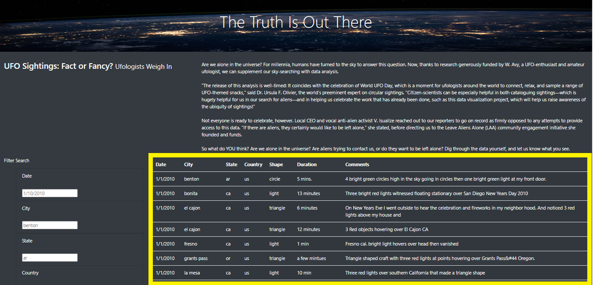
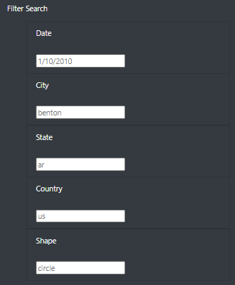
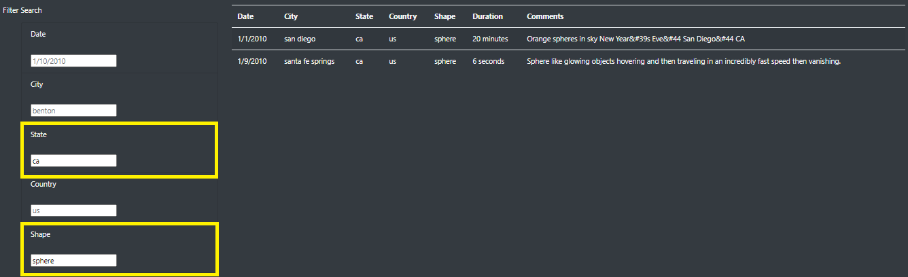

# UFOs

## Project Overview
In this project we will focus on building a dynamic UFO sightings webpage by inserting JavaScript into an HTML page. We will start by building a table to hold and neatly display the UFO data we want to work with. Then we'll add filters of that table which lets users refine their UFO search on multiple elements. The table and it's filters will be inserted into, and visually displayed by an HTML page. We'll use basic HTML, Bootstrap, and CSS to build and style the page. The end result will be a presentation of data that is both visually appealing and interactive.  

## Results and Webpage Functionality 
- ***Initial webpage table:*** When we first navigate to our dynamic site we find a table containing records of 111 UFO sightings. That's a lot of data for the end user to sift through and digest all on their own. (see initial webpage below) 

- ***Filter search section:*** In the lower left of our webpage we find a "Filter Search" section (shown below). In this section we find five text input boxes that allow us to filter our table by one or even multiple free form entries. 

- ***Applying filters to our table:*** We chose to filter the table by "State" and "Shape" looking for sphere shaped sightings in the state of California. After the filters are applied to the database we find 2 results that meet our parameters. The results showing in the Date, City, and Country input boxes are only placeholders to help guide the end user - they do not impact the filter results.  
